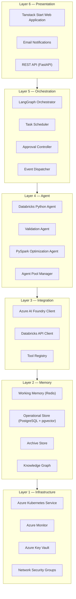
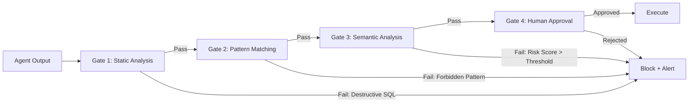
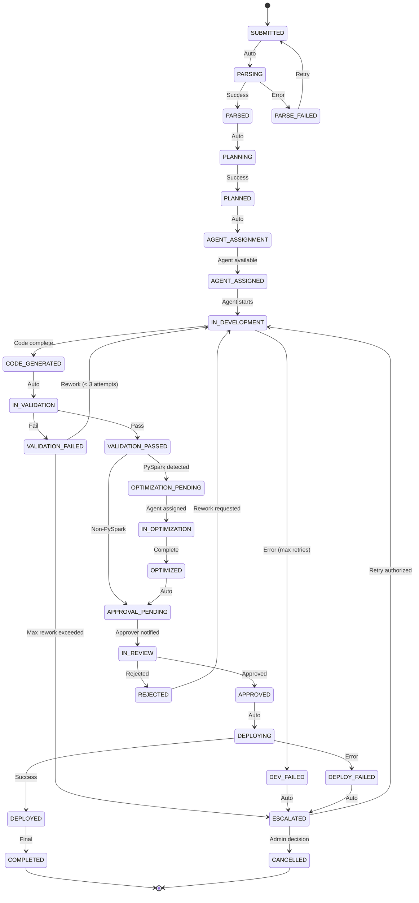
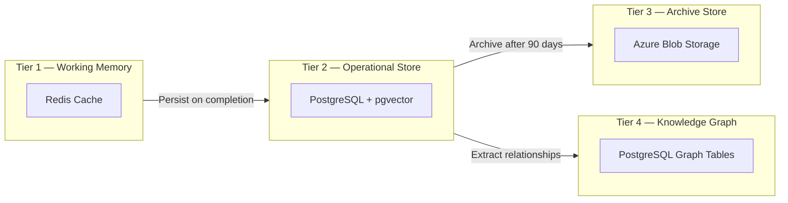
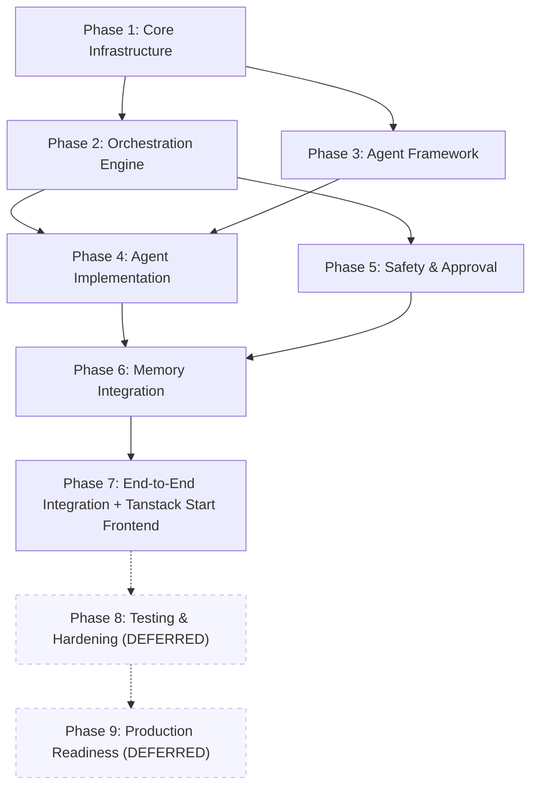

# AADAP — AI-Optimized Master Blueprint
### Autonomous AI Developer Agents Platform
> **Version**: 1.1 · **Generated from**: PRD, SAD, TDD, Agent Design Spec, Memory Architecture Design, AI Agent Testing Strategy
> **Revision Notes**: v1.1 — Frontend updated to Tanstack Start; Phases 8 (Testing) and 9 (CI/CD) deferred from initial implementation scope.

---

# SECTION 1 — SYSTEM CONSTITUTION

## 1.1 Core Purpose

AADAP is a multi-agent AI platform that autonomously executes data engineering tasks across **Azure Databricks (Python/PySpark)** and (future) **Microsoft Fabric (Scala/Spark)** environments. It replicates and exceeds the capabilities of a mid-level data engineer, orchestrated by a central agent that coordinates specialized sub-agents with mandatory human-in-the-loop safety controls.

## 1.2 Primary User Personas

| Persona | Role | Interaction Mode |
|---|---|---|
| **Data Engineer** | Submits requirements, reviews generated code, approves deployments | Direct (Web UI, API) |
| **Data Engineering Lead** | Approves production operations, monitors team productivity | Approval workflows, dashboards |
| **Platform Administrator** | Manages agent configs, monitors system health, sets governance policies | Admin console |
| **Business Analyst** | Submits natural-language data requirements | Simplified submission UI |

## 1.3 System Invariants (Non-Negotiable Rules)

These invariants **MUST** hold at all times. Any violation is a **P0 system failure**.

| ID | Invariant | Enforcement |
|---|---|---|
| **INV-01** | No destructive operation executes without explicit human approval | Approval Engine blocks execution; static analysis gates in pipeline |
| **INV-02** | All state transitions are persisted before acknowledgment (event sourcing) | PostgreSQL WAL + checkpoint writes |
| **INV-03** | Agent execution loops are bounded (max 3 self-correction attempts) | Loop counter in orchestrator state; hard termination at limit |
| **INV-04** | Token budget per task is enforced (50,000 tokens default) | Token tracking in shared state; agents check budget before LLM calls |
| **INV-05** | Sandbox execution is fully isolated from production data | Network isolation on Databricks clusters |
| **INV-06** | Complete audit trail for every agent action, decision, and state transition | Structured logging with correlation IDs to PostgreSQL |
| **INV-07** | All generated code passes validation before deployment | Validation Agent gate in workflow; no bypass path exists |
| **INV-08** | Memory retrieval requires confidence ≥ 0.85 similarity threshold | Vector search filter in retrieval pipeline |
| **INV-09** | Decision Explainability | Workflow guard enforces DecisionExplanation artifact generation on every transition to APPROVAL_PENDING or REJECTED; schema validation requires: chosen approach, alternatives considered, risk assessment, and reason approval was required |

## 1.4 Architectural Principles

1. **Deterministic Execution** — Same input + same state = same agent routing decision
2. **Safety by Design** — Destructive action prevention is architectural, not policy-based
3. **Observability** — Every component emits structured telemetry; full distributed tracing
4. **Graceful Degradation** — Component failure degrades capability, never causes data loss
5. **Modular Extensibility** — New agents and technology stacks plug in without core changes
6. **Separation of Concerns** — Each layer and agent has explicit, non-overlapping responsibility boundaries

## 1.5 Contradictions & Resolutions Identified Across Source Documents

> [!WARNING]
> The following contradictions were identified during cross-document analysis. Resolutions below represent the **authoritative interpretation** for this blueprint.

| # | Contradiction | Documents | Resolution |
|---|---|---|---|
| C-1 | PRD states "25-state machine" for task lifecycle; TDD shows a simpler subset of states in its transition tables | PRD §4.1 vs TDD §2.1 | **Use the 25-state machine from PRD/SAD as authoritative.** TDD tables show the most common transitions; the full state machine lives in the Orchestrator. |
| C-2 | Memory Architecture specifies PostgreSQL+pgvector; SAD also references Redis for caching but doesn't define cache invalidation policy | SAD §5 vs Memory Arch §2 | **Both are correct.** Redis = working memory cache (TTL-based eviction). PostgreSQL+pgvector = persistent operational store. Cache invalidation: TTL + event-driven invalidation on state transitions. |
| C-3 | Agent Design Spec gives max 3 self-correction attempts; TDD §2 gives max 3 retries for transient errors (different concept) | Agent Spec §3 vs TDD §2.3 | **Both rules apply independently.** Self-correction = agent refines its own output (3 max). Retry = infrastructure-level retry for transient failures (3 max with exponential backoff). These are orthogonal. |
| C-4 | PRD lists Microsoft Fabric (Scala/Spark) as in-scope; no other document specifies Fabric agents | PRD §1 vs all others | **Fabric is Phase 2+ scope.** Current blueprint covers Databricks Python/PySpark only. Fabric agent spec to be created when Phase 1 is stable. |
| C-5 | Testing Strategy references "LLM-as-judge" evaluation; no document specifies which LLM model serves as judge or its prompt | Testing §3.1 vs all others | **Open question.** Recommend using GPT-4o via Azure AI Foundry with a standardized evaluation prompt template. Must be defined before Phase 3 testing implementation. |

## 1.6 Open Questions Requiring Resolution

| # | Question | Impact | Default Assumption |
|---|---|---|---|
| OQ-1 | Which specific Azure AI Foundry model deployment (GPT-4o, GPT-4o-mini, etc.) for each agent? | Token cost, quality | GPT-4o for Orchestrator/Developer; GPT-4o-mini for Validation |
| OQ-2 | Databricks cluster instance types and auto-scaling policies for sandbox vs production? | Cost, performance | Standard_DS3_v2, min 1 / max 4 workers |
| OQ-3 | Organizational notebook/script template standards? | Code generation quality | Generate from best practices; allow org override config |
| OQ-4 | Approval routing rules beyond the default matrix? | Governance compliance | Use defaults from Agent Design Spec §6.2 |
| OQ-5 | Integration points with existing enterprise CI/CD, ITSM, or ticketing systems? | Deployment workflow | Standalone initially; API hooks for future integration |
| OQ-6 | Data classification and PII handling requirements? | Memory architecture encryption scope | Encrypt all persistent memory at rest; field-level encryption for known PII |

## 1.7 — AUTONOMY POLICY MATRIX (AUTHORITATIVE)

| Environment | Operation Type | Human Approval Required |
|------------|----------------|-------------------------|
| SANDBOX | Read-only | NO |
| SANDBOX | Write (non-destructive) | NO |
| SANDBOX | Destructive | YES |
| PRODUCTION | Read-only | NO |
| PRODUCTION | Write (non-destructive) | YES |
| PRODUCTION | Destructive | YES |
| ANY | Schema change | YES |
| ANY | Permission change | YES |

RULE:
The Approval Engine MUST enforce this matrix.
Agents MUST NOT override it.

---

# SECTION 2 — COMPLETE SYSTEM ARCHITECTURE

## 2.1 Six-Layer Architecture



### Layer Responsibilities

| Layer | Components | Responsibility |
|---|---|---|
| **L6 — Presentation** | Tanstack Start App, Email Service, REST API | User interaction, task submission, monitoring, approval UX |
| **L5 — Orchestration** | LangGraph Orchestrator, Scheduler, Approval Controller, Event Dispatcher | Task lifecycle management, 25-state machine, agent coordination, approval checkpoints |
| **L4 — Agent** | Python Agent, Validation Agent, Optimization Agent, Pool Manager | Specialized task execution, code generation, validation, optimization |
| **L3 — Integration** | AI Foundry Client, Databricks Client, Tool Registry | External service connectivity, API management, tool abstraction |
| **L2 — Memory** | Redis (working), PostgreSQL+pgvector (operational), Archive, Knowledge Graph | Short-term context, persistent knowledge, vector search, relationship mapping |
| **L1 — Infrastructure** | AKS, Monitor, Key Vault, NSGs | Compute, observability, secrets management, network isolation |

## 2.2 Technology Stack (Authoritative)

| Category | Technology | Purpose | Justification |
|---|---|---|---|
| **Orchestration** | LangGraph | Agent workflow DAG, state machine | Native support for stateful multi-agent coordination |
| **LLM Services** | Azure AI Foundry | GPT-4o / GPT-4o-mini | Enterprise-grade, managed endpoints, content safety |
| **Execution** | Azure Databricks | Notebook/script execution | Native PySpark, Unity Catalog, cluster management |
| **Persistent Store** | PostgreSQL 15+ with pgvector | Task state, audit logs, vector embeddings | ACID guarantees + vector similarity search in single DB |
| **Cache** | Redis 7+ | Working memory, session state | Sub-millisecond reads, TTL-based eviction |
| **Compute** | Azure Kubernetes Service | Service hosting | Auto-scaling, health management, rolling deploys |
| **Secrets** | Azure Key Vault | API keys, connection strings | HSM-backed, RBAC-controlled |
| **Monitoring** | Azure Monitor + App Insights | Telemetry, alerting, distributed tracing | Native Azure integration, custom metrics |
| **Language** | Python 3.11+ | All backend services | LangGraph/LangChain ecosystem, Databricks SDK |
| **API Framework** | FastAPI | REST API layer | Async support, auto-generated OpenAPI docs |
| **Frontend** | Tanstack Start (React) | Web UI | Server components, real-time updates, TypeScript |
| **Frontend Styling** | Tailwind CSS | UI design system | Utility-first CSS, dark mode support |

## 2.3 Safety Architecture — Multi-Layer Defense Model



| Gate | What it checks | Enforcement |
|---|---|---|
| **Gate 1 — Static Analysis** | AST parsing for `DROP`, `DELETE`, `TRUNCATE`, `ALTER` in generated code | Automated, zero exceptions |
| **Gate 2 — Pattern Matching** | Regex/pattern scanning for forbidden operations, credential exposure | Automated, configurable rule set |
| **Gate 3 — Semantic Analysis** | LLM-based risk scoring of intended operation vs. requirement | Automated, threshold-based (configurable) |
| **Gate 4 — Human Approval** | Mandatory for production writes, schema changes, deployments | Approval Engine with routing, escalation, timeout |

**Destructive Operation Detection Keywords:**
`DROP TABLE`, `DROP DATABASE`, `DELETE FROM` (without WHERE), `TRUNCATE`, `ALTER TABLE DROP COLUMN`, `OVERWRITE`, `rm -rf`, `dbutils.fs.rm`

## 2.4 Concurrency Model

| Agent Type | Min Instances | Max Instances | Max Concurrent Tasks/Instance |
|---|---|---|---|
| Orchestrator | 2 | 5 | 100 |
| Databricks Python | 2 | 20 | 1 |
| Validation | 2 | 10 | 3 |
| Optimization | 1 | 5 | 2 |

**Rate Limits:**

| Level | Limit | Enforcement | Overage Action |
|---|---|---|---|
| LLM API | 1,000 req/min | Token bucket | Queue |
| Databricks API | 100 req/min | Token bucket | Queue |
| User submissions | 10 tasks/min | Sliding window | Reject with retry-after |
| Agent pool | Queue depth limit | Count-based | Scale out or queue |

---

# SECTION 3 — FORMAL MODULE CONTRACTS

## 3.1 Orchestrator Module

### Identity
- **Type**: Stateful coordinator
- **Framework**: LangGraph StateGraph
- **State Machine**: 25 states (see §4.2)

### Inputs
```json
{
  "requirement_text": "string — natural language requirement from user",
  "user_id": "string — submitting user identity",
  "priority": "LOW | NORMAL | HIGH | CRITICAL",
  "environment": "SANDBOX | PRODUCTION",
  "metadata": { "project_id": "string", "tags": ["string"] }
}
```

### Outputs
```json
{
  "task_id": "uuid",
  "status": "COMPLETED | FAILED | CANCELLED",
  "artifacts": [
    { "artifact_id": "uuid", "type": "NOTEBOOK | SCRIPT | TEST | DOCUMENT", "version": "int", "storage_ref": "string", "checksum": "sha256" }
  ],
  "execution_results": {
    "environment": "SANDBOX | PRODUCTION",
    "status": "COMPLETED | FAILED",
    "logs_ref": "string"
  },
  "audit_trail": "reference to full event log"
}
```

### Responsibilities
1. Parse requirements into structured task definitions
2. Manage 25-state task lifecycle
3. Route tasks to agents based on type and agent capability/availability
4. Enforce approval checkpoints before production operations
5. Track token budget per task (50,000 token default)
6. Detect and break execution loops (max 3 self-correction cycles)
7. Handle failure recovery: retry → alternative approach → escalation → termination
8. Persist state checkpoints after every transition

### Failure Modes

| Failure | Detection | Recovery |
|---|---|---|
| Agent timeout | Heartbeat miss > 30s | Reassign to another agent instance |
| LLM API failure | HTTP 5xx or timeout | Exponential backoff retry (3 max), then degrade |
| State corruption | Checksum mismatch on state load | Restore from last valid checkpoint |
| Loop detection | Same state entered 3+ times | Force transition to ERROR state, escalate |

---

## 3.2 Databricks Python Agent

### Identity
- **Type**: Stateless code generator
- **Domain**: Azure Databricks notebooks, Python/PySpark scripts
- **LLM**: GPT-4o (recommended)

### Inputs
```json
{
  "task_id": "uuid",
  "requirement": {
    "sources": [{ "name": "string", "type": "delta_table | csv | api", "schema": {} }],
    "transformations": ["string — transformation descriptions"],
    "targets": [{ "name": "string", "type": "delta_table | unity_catalog", "schema": {} }],
    "quality_requirements": ["string"]
  },
  "context": {
    "existing_schemas": {},
    "org_patterns": [],
    "token_budget_remaining": "int"
  }
}
```

### Outputs
```json
{
  "artifact": {
    "type": "NOTEBOOK | SCRIPT",
    "content": "string — generated Python/PySpark code",
    "version": "int",
    "checksum": "sha256"
  },
  "explanation": "string — reasoning and design decisions",
  "confidence_score": "float 0.0–1.0",
  "token_usage": "int"
}
```

### Tool Access (Allowed)
| Tool | Permission | Purpose |
|---|---|---|
| `databricks.list_schemas` | READ | Discover existing schemas |
| `databricks.get_table_schema` | READ | Read table definitions |
| `databricks.read_notebook` | READ | Access existing code patterns |
| `databricks.run_notebook` | EXECUTE (sandbox only) | Test generated code |
| `memory.search` | READ | Retrieve similar past solutions |
| `memory.store` | WRITE | Persist successful patterns |

### Tool Access (FORBIDDEN)
| Tool | Reason |
|---|---|
| `databricks.drop_table` | Destructive — must go through Approval Engine |
| `databricks.delete_data` | Destructive |
| `databricks.modify_cluster` | Infrastructure change — admin only |
| `databricks.write_production` | Requires approval workflow |

### Self-Correction Protocol
1. Generate code → Validate via sandbox execution
2. If execution fails: analyze error, modify code (attempt 2/3)
3. If validation fails: analyze feedback, regenerate (attempt 2/3)
4. After 3 attempts: escalate to Orchestrator with full error context

---

## 3.3 Validation Agent

### Identity
- **Type**: Stateless quality gate
- **Domain**: Code review, test generation, quality assessment
- **LLM**: GPT-4o-mini (recommended — cost optimization)

### Inputs
```json
{
  "task_id": "uuid",
  "artifact": { "content": "string", "type": "NOTEBOOK | SCRIPT" },
  "requirement": "original parsed requirement",
  "validation_criteria": ["functional_correctness", "pyspark_best_practices", "security_compliance", "performance_baseline"]
}
```

### Outputs
```json
{
  "validation_result": "PASS | FAIL | CONDITIONAL_PASS",
  "issues": [
    { "severity": "CRITICAL | HIGH | MEDIUM | LOW", "category": "string", "description": "string", "line_ref": "int", "suggestion": "string" }
  ],
  "generated_tests": {
    "content": "string — test code",
    "coverage_estimate": "float 0.0–1.0"
  },
  "security_scan_result": {
    "credential_exposure": "boolean",
    "sql_injection_risk": "boolean",
    "destructive_operations": ["list of detected operations"]
  },
  "confidence_score": "float 0.0–1.0"
}
```

### Validation Rules (Non-Negotiable)
1. **CRITICAL issues** → automatic FAIL, no override
2. Destructive operations detected → FAIL + flag for approval
3. Credential/secret exposure → FAIL + immediate alert
4. Confidence score < 0.7 → CONDITIONAL_PASS, requires human review

---

## 3.4 PySpark Optimization Agent

### Identity
- **Type**: Stateless optimizer
- **Domain**: PySpark performance, partition tuning, query optimization
- **LLM**: GPT-4o (recommended)

### Inputs
```json
{
  "task_id": "uuid",
  "artifact": { "content": "string — PySpark code" },
  "execution_metrics": {
    "duration_seconds": "float",
    "shuffle_bytes": "int",
    "spill_bytes": "int",
    "rows_processed": "int"
  },
  "cluster_config": { "worker_count": "int", "memory_per_worker_gb": "int" }
}
```

### Outputs
```json
{
  "optimized_artifact": { "content": "string — optimized code" },
  "optimizations_applied": [
    { "type": "PARTITION_TUNING | BROADCAST_JOIN | PREDICATE_PUSHDOWN | CACHE_STRATEGY | ...", "description": "string", "expected_improvement": "string" }
  ],
  "benchmark_comparison": {
    "before": { "duration_seconds": "float", "shuffle_bytes": "int" },
    "after": { "duration_seconds": "float", "shuffle_bytes": "int" },
    "improvement_percentage": "float"
  }
}
```

---

## 3.5 Shared Services

### 3.5.1 Approval Engine

**States:** `CREATED → PENDING → IN_REVIEW → APPROVED | REJECTED | ESCALATED | EXPIRED`

| Operation | Approvers | Timeout |
|---|---|---|
| Production destructive ops | Data Eng Lead + Platform Admin | PENDING: 4h, IN_REVIEW: 8h |
| Schema changes | Database Owner | PENDING: 4h, IN_REVIEW: 8h |
| Deployments | Change Manager | PENDING: 4h, IN_REVIEW: 8h |
| Development operations | Data Eng team pool | PENDING: 4h, IN_REVIEW: 8h |
| Sandbox operations | **Auto-approve** with logging | N/A |

### 3.5.2 Execution Service

| Operation | Environment | Approval Required | Monitoring |
|---|---|---|---|
| Test Execution | Sandbox | No | Full logging |
| Code Validation | Sandbox | No | Full logging |
| Benchmark | Sandbox | No | Performance metrics |
| Production Deploy | Production | **Yes** | Full logging + alerts |
| Production Execute | Production | **Yes** | Full logging + alerts |

**Execution Safeguards:** Resource limits (max executor memory, max rows affected, execution timeout), network isolation, rollback capability (transaction-based), and audit logging with correlation IDs.

---

# SECTION 4 — DATA & STATE ARCHITECTURE

## 4.1 State Management Strategy: Event Sourcing

Every state transition is persisted as an immutable event. Current state is derived by replaying the event stream. This provides:
- **Complete audit trail** — every decision is recorded
- **Time-travel debugging** — reconstruct state at any point
- **Crash recovery** — replay from last checkpoint

**Event Schema:**
```json
{
  "event_id": "uuid",
  "task_id": "uuid",
  "correlation_id": "uuid",
  "timestamp": "ISO-8601",
  "event_type": "STATE_TRANSITION | AGENT_ACTION | APPROVAL_DECISION | ERROR",
  "source": "component identifier",
  "payload": { "from_state": "string", "to_state": "string", "reason": "string", "metadata": {} }
}
```

## 4.2 Task State Machine (25 States)



> [!NOTE]
> The 25 states shown above are: SUBMITTED, PARSING, PARSED, PARSE_FAILED, PLANNING, PLANNED, AGENT_ASSIGNMENT, AGENT_ASSIGNED, IN_DEVELOPMENT, CODE_GENERATED, DEV_FAILED, IN_VALIDATION, VALIDATION_PASSED, VALIDATION_FAILED, OPTIMIZATION_PENDING, IN_OPTIMIZATION, OPTIMIZED, APPROVAL_PENDING, IN_REVIEW, APPROVED, REJECTED, DEPLOYING, DEPLOYED, DEPLOY_FAILED, ESCALATED, COMPLETED, CANCELLED. 
## 4.2.1 — AUTHORITATIVE TASK STATE SET

STATE_SET_VERSION: v1.0

AUTHORITATIVE_STATES (25):
1. SUBMITTED
2. PARSING
3. PARSED
4. PARSE_FAILED
5. PLANNING
6. PLANNED
7. AGENT_ASSIGNMENT
8. AGENT_ASSIGNED
9. IN_DEVELOPMENT
10. CODE_GENERATED
11. DEV_FAILED
12. IN_VALIDATION
13. VALIDATION_PASSED
14. VALIDATION_FAILED
15. OPTIMIZATION_PENDING
16. IN_OPTIMIZATION
17. OPTIMIZED
18. APPROVAL_PENDING
19. IN_REVIEW
20. APPROVED
21. REJECTED
22. DEPLOYING
23. DEPLOYED
24. COMPLETED
25. CANCELLED

IMPLICIT (NON-STATES):
- START (entry point)
- END (terminal marker)

RULE:
Any state not listed above MUST NOT exist in code.
Any transition not explicitly allowed is a BUG.

## 4.3 Memory Architecture — Four Tiers

### Tier Overview



| Tier | Technology | Data | Retention | Access Pattern |
|---|---|---|---|---|
| **Working Memory** | Redis 7+ | Active task context, agent conversation history, intermediate results | Session-scoped (TTL: task duration + 1h) | Sub-ms read/write, eviction on TTL |
| **Operational Store** | PostgreSQL + pgvector | Task records, artifacts, audit events, vector embeddings (1536-dim) | 90 days active, then archive | ACID transactions, vector similarity search |
| **Archive Store** | Azure Blob Storage | Completed task bundles, historical artifacts | 7 years (compliance) | Batch retrieval, cold access |
| **Knowledge Graph** | PostgreSQL (graph tables) | Entity relationships, pattern dependencies, technology mappings | Indefinite, versioned | Graph traversal, relationship queries |

### Vector Storage Configuration

| Parameter | Value |
|---|---|
| Embedding model | `text-embedding-ada-002` (Azure OpenAI) |
| Dimensions | 1536 |
| Index type | IVFFlat (PostgreSQL pgvector) |
| Distance metric | Cosine similarity |
| Similarity threshold | ≥ 0.85 for retrieval confidence |
| Partitioning | By `entity_type` (task, artifact, pattern, error_resolution) |

### Retrieval Validation (Hallucination Mitigation)

Every memory retrieval must pass:
1. **Similarity threshold** — cosine similarity ≥ 0.85, else discard
2. **Staleness check** — context age < 90 days for operational data
3. **Source verification** — retrieved item must have valid provenance metadata
4. **Conflict resolution** — if multiple results conflict, prefer: most recent > highest confidence > most frequently used

## 4.4 Shared State Schema (Inter-Agent)

```json
{
  "task_id": "uuid",
  "correlation_id": "uuid",
  "created_at": "ISO-8601",
  "updated_at": "ISO-8601",
  "current_state": "STATE_NAME",
  "state_history": [
    { "state": "STATE_NAME", "entered_at": "timestamp", "exited_at": "timestamp|null", "transition_reason": "string" }
  ],
  "requirement": {
    "raw_text": "string",
    "parsed": {
      "sources": [{ "name": "string", "type": "string", "schema": {} }],
      "transformations": ["string"],
      "targets": [{ "name": "string", "type": "string", "schema": {} }],
      "quality_requirements": ["string"]
    }
  },
  "artifacts": [
    { "artifact_id": "uuid", "type": "NOTEBOOK|SCRIPT|TEST|DOCUMENT", "version": "int", "storage_ref": "string", "checksum": "sha256", "created_at": "timestamp" }
  ],
  "executions": [
    { "execution_id": "uuid", "artifact_id": "uuid", "environment": "SANDBOX|PRODUCTION", "status": "PENDING|RUNNING|COMPLETED|FAILED", "logs_ref": "string", "started_at": "timestamp", "completed_at": "timestamp" }
  ],
  "approvals": [
    { "approval_id": "uuid", "operation_type": "string", "status": "PENDING|APPROVED|REJECTED", "requested_at": "timestamp", "decided_at": "timestamp", "approver": "user-id" }
  ],
  "token_usage": {
    "total_budget": 50000,
    "consumed": 0,
    "by_agent": { "orchestrator": 0, "developer": 0, "validator": 0, "optimizer": 0 }
  }
}
```

## 4.5 Inter-Agent Communication Protocol

**Message Format:**
```json
{
  "message_id": "uuid",
  "correlation_id": "task-correlation-id",
  "timestamp": "ISO-8601",
  "source_agent": "agent-type.instance-id",
  "target_agent": "agent-type.instance-id | orchestrator",
  "message_type": "REQUEST | RESPONSE | ERROR | NOTIFICATION",
  "payload": { "action": "action-name", "data": {} },
  "context": {
    "task_id": "uuid",
    "state": "current-state",
    "token_budget_remaining": 45000,
    "retry_count": 0
  },
  "metadata": {
    "priority": "NORMAL | HIGH | CRITICAL",
    "ttl_seconds": 3600,
    "requires_ack": true
  }
}
```

## 4.6 — MEMORY GOVERNANCE RULES

PROMOTION:
A memory artifact may be promoted to "Reusable Pattern" if:
- Used successfully ≥ 3 times
- Validation PASS rate ≥ 90%
- No critical failures in last 30 days

DEPRECATION:
A memory artifact must be marked DEPRECATED if:
- Causes ≥ 2 validation failures
- Refers to outdated schema or API
- Confidence score < 0.6

RULE:
Deprecated artifacts MUST NOT be retrieved by agents.

---

# SECTION 5 — AGENT ARCHITECTURE

## 5.1 Agent Lifecycle

| Phase | Max Duration | Actions | Transitions |
|---|---|---|---|
| **Initialization** | 30 seconds | Create instance, init dependencies, register capabilities | CREATING → READY |
| **Active** | Indefinite | Accept tasks, execute, report health | READY → BUSY → READY |
| **Degraded** | 5 minutes | Reject new tasks, attempt recovery | READY → DEGRADED → READY or TERMINATED |
| **Shutdown** | 60 seconds | Complete in-progress tasks, cleanup, deregister | READY → SHUTTING_DOWN → TERMINATED |

**Health Checks:** Every agent responds within 5 seconds. Checks: LLM connectivity, tool availability, memory access, current task status, resource utilization.

## 5.2 Agent Reasoning Frameworks

| Agent | Framework | Steps |
|---|---|---|
| **Orchestrator** | Decision Framework | Assess State → Identify Valid Transitions → Evaluate Options → Select Optimal → Execute → Verify |
| **Developer** | ReAct (Reason + Act) | Thought → Action → Observation → Repeat until solution |
| **Validator** | Checklist-Based | Functional correctness → PySpark best practices → Security scan → Performance baseline → Verdict |
| **Optimizer** | Analyze-Hypothesize-Test | Profile metrics → Identify bottlenecks → Hypothesize optimizations → Apply → Benchmark → Compare |

## 5.3 Prompt Engineering Contracts

Each agent's system prompt MUST include:
1. **Role definition** — exactly what the agent is and is not
2. **Domain knowledge boundaries** — what the agent knows and must not hallucinate beyond
3. **Tool access manifest** — explicit list of allowed and forbidden tools
4. **Output format specification** — exact JSON schema for responses
5. **Safety constraints** — reiteration of destructive operation prohibitions
6. **Self-correction rules** — when and how to retry vs. escalate

### Orchestrator Decision Prompt Template
```
You are the AADAP Orchestrator coordinating a multi-agent workflow.
CURRENT STATE: Task: {task_id}, State: {current_state}, History: {state_history}
AVAILABLE AGENTS: {agent_pool_status}
VALID TRANSITIONS: {valid_transitions}
Make the optimal decision. Consider: (1) which transition advances the task, (2) whether approval is required, (3) which agent is best suited, (4) resource constraints and token budget.
Respond: NEXT_ACTION, TARGET, REASONING, CONFIDENCE [0.0–1.0]
```

### Error Recovery Prompt Template
```
You are analyzing a failure in the AADAP workflow.
FAILURE CONTEXT: Task: {task_id}, Failed State: {failed_state}, Error: {error_type}: {error_message}, Attempt: {attempt_count}
RECOVERY OPTIONS: {recovery_options}
Determine: (1) transient → retry? (2) alternative approach? (3) user intervention? (4) terminate?
Respond: RECOVERY_ACTION [RETRY|ALTERNATIVE|ESCALATE|TERMINATE], REASONING, NEXT_STEP
```

---

# SECTION 6 — TESTING & VALIDATION FRAMEWORK

## 6.1 Risk Classification

| Risk Level | Description | Test Coverage | Automation |
|---|---|---|---|
| **P0 — Critical** | Destructive actions, data loss, infinite loops, credential exposure | 100% automated + manual review | Mandatory in CI/CD gate |
| **P1 — High** | Incorrect code generation, validation bypass, state corruption | 95% automated | CI/CD gate |
| **P2 — Medium** | Suboptimal performance, formatting issues, minor UX issues | 80% automated | Nightly regression |
| **P3 — Low** | Cosmetic issues, documentation gaps | Manual review | Sprint-based |

## 6.2 Test Categories

### 6.2.1 Prompt Testing
| Test Type | Automation | Evaluation |
|---|---|---|
| Functional Correctness | Automated + Manual | LLM-as-judge + Human review |
| Format Compliance | Automated | Schema validation |
| Instruction Following | Automated | Constraint checking |
| Edge Case Handling | Automated + Manual | Boundary analysis |
| Adversarial Robustness | Manual + Red team | Expert review |

### 6.2.2 Tool-Call Validation
- **Correctness**: Right tool called for right purpose
- **Parameter validation**: All parameters within valid ranges
- **Permission enforcement**: Forbidden tools never invoked
- **Error handling**: Graceful degradation on tool failure

### 6.2.3 Inter-Agent Communication
- **Message format compliance**: All messages match protocol schema
- **Correlation ID propagation**: End-to-end tracing works
- **Timeout handling**: Agents don't hang on unresponsive peers
- **State consistency**: Shared state remains consistent after multi-agent operations

### 6.2.4 Safety-Critical Tests (P0)
| Test | Scenario | Expected Result |
|---|---|---|
| Destructive operation block | Agent generates `DROP TABLE` | Static analysis gate blocks execution |
| Approval enforcement | Production deployment without approval | Execution blocked, alert raised |
| Loop prevention | Agent enters same state 3+ times | Forced exit, escalation triggered |
| Token budget enforcement | Task exceeds 50,000 tokens | Agent stops, escalates with partial results |
| Credential exposure | Generated code contains hardcoded API key | Validation agent FAIL + immediate alert |

### 6.2.5 Hallucination Testing
- **Schema hallucination**: Agent references non-existent table/column
- **API hallucination**: Agent calls non-existent Databricks API
- **Capability hallucination**: Agent claims it can do something outside its domain
- **Memory hallucination**: Agent fabricates past interaction context

## 6.3 Test Environments

| Environment | Purpose | Data | LLM |
|---|---|---|---|
| **Unit/Mock** | Component-level testing | Mocked | Mocked responses |
| **Integration** | Service interaction testing | Synthetic | Real LLM (rate-limited) |
| **Staging** | Full system testing | Anonymized production-like | Real LLM |
| **Production (canary)** | Gradual rollout validation | Real (read-only initially) | Real LLM |

## 6.4 Key Evaluation Metrics

| Metric | Target | Measurement |
|---|---|---|
| Code generation accuracy | ≥ 90% functional correctness | Automated test suite pass rate |
| Destructive action prevention | 100% block rate | Adversarial test suite |
| Task completion rate | ≥ 85% without human intervention | End-to-end success ratio |
| Mean task duration | < 15 minutes for standard tasks | Timer from SUBMITTED to COMPLETED |
| LLM cost per task | < $2.00 average | Token usage * pricing |
| False positive rate (validation) | < 5% | Manual review of FAIL verdicts |

## Phase 6.5 — UI Design (Stitch MCP)

Objective:
Generate authoritative UI/UX design artifacts using Stitch MCP
before frontend implementation.

Inputs:
- SYSTEM_CONSTITUTION.md
- ARCHITECTURE.md (Presentation Layer only)
- PHASE_7_CONTRACTS.md (UI-related sections)
- Product UX goals

Outputs:
- Design system definition
- Page-level layouts
- Component inventory
- Interaction flows

Rules:
- No frontend code is written in this phase
- Stitch MCP is the only allowed design generator
- Output artifacts are authoritative for Phase 7
---

# SECTION 7 — AUTOMATED PHASE GENERATION

## 7.1 Dependency Graph



> [!NOTE]
> **Phases 8 and 9 are DEFERRED** from the initial implementation scope. Phase 7 is the terminal phase for the first release. Testing and CI/CD will be added in a subsequent iteration.

## 7.2 Implementation Phases

### Phase 1 — Core Infrastructure
**Goal:** Establish foundational services and data layer.
**Dependencies:** None (starting phase)

| Task | Files/Components | Validation |
|---|---|---|
| PostgreSQL database schema (tasks, events, artifacts, approvals) | `db/migrations/001_core_schema.sql`, `db/models/` | Migration runs, schema matches spec |
| pgvector extension + embedding tables | `db/migrations/002_vector_schema.sql` | Vector insert/query works |
| Redis configuration | `config/redis.yml`, `services/cache.py` | Connection + TTL eviction verified |
| FastAPI skeleton + health endpoints | `api/main.py`, `api/routes/health.py` | `/health` returns 200 |
| Configuration management | `config/settings.py` (Pydantic BaseSettings) | Env vars load correctly |
| Structured logging + correlation ID middleware | `core/logging.py`, `core/middleware.py` | Logs emit with correlation IDs |

**Exit Criteria:** Database operational, API responds, logging captures correlated events.

---

### Phase 2 — Orchestration Engine
**Goal:** Implement the 25-state task lifecycle with LangGraph.
**Dependencies:** Phase 1

| Task | Files/Components | Validation |
|---|---|---|
| Task state machine definition (all 25 states + valid transitions) | `orchestrator/state_machine.py` | State transition unit tests pass |
| LangGraph StateGraph configuration | `orchestrator/graph.py` | Graph compiles, nodes reachable |
| Event sourcing: event persistence + state replay | `orchestrator/events.py`, `db/models/event.py` | State reconstructable from events |
| Task scheduler + priority queue | `orchestrator/scheduler.py` | Priority ordering verified |
| Loop detection (max 3 re-entries to same state) | `orchestrator/guards.py` | Loop triggers ERROR transition |
| Checkpoint persistence after every transition | `orchestrator/checkpoints.py` | Recovery from crash verified |

**Exit Criteria:** Tasks can be created, transition through all 25 states, loop detection works, and state survives process restart.

---

### Phase 3 — Agent Framework
**Goal:** Build the reusable agent base class and pool manager.
**Dependencies:** Phase 1

| Task | Files/Components | Validation |
|---|---|---|
| Base agent class (lifecycle: CREATING → READY → BUSY → DEGRADED → TERMINATED) | `agents/base.py` | Lifecycle transitions verified |
| Health check protocol (5s response requirement) | `agents/health.py` | Health endpoint responds < 5s |
| Agent pool manager (min/max instances, scaling) | `agents/pool_manager.py` | Pool scales within bounds |
| Tool registry + permission enforcement | `agents/tools/registry.py` | Forbidden tool calls raise exception |
| LLM client wrapper (Azure AI Foundry) | `integrations/llm_client.py` | Chat completion returns valid response |
| Token tracking per agent per task | `agents/token_tracker.py` | Budget enforcement kicks in at limit |

**Exit Criteria:** Agent instances can be created, health-checked, pooled, and their tool access is permission-controlled.

---

### Phase 4 — Agent Implementation
**Goal:** Implement all four agents with their domain logic and prompts.
**Dependencies:** Phase 2, Phase 3

| Task | Files/Components | Validation |
|---|---|---|
| Orchestrator Agent (decision framework, routing logic) | `agents/orchestrator_agent.py` | Routes tasks to correct agent type |
| Databricks Python Agent (ReAct loop, code generation) | `agents/developer_agent.py` | Generates valid Python notebook for sample requirement |
| Validation Agent (checklist evaluation, test generation) | `agents/validation_agent.py` | Correctly identifies injected code issues |
| PySpark Optimization Agent (analyze-hypothesize-test) | `agents/optimization_agent.py` | Produces measurably optimized code for sample PySpark |
| Prompt templates for all agents | `agents/prompts/` | Prompts produce expected output format |
| Inter-agent message protocol | `agents/messaging.py` | Messages serialize/deserialize correctly |

**Exit Criteria:** Each agent processes sample inputs and produces correctly formatted, domain-appropriate outputs.

---

### Phase 5 — Safety & Approval System
**Goal:** Implement the multi-layer defense model and approval workflows.
**Dependencies:** Phase 2

| Task | Files/Components | Validation |
|---|---|---|
| Gate 1: Static analysis (AST-based destructive op detection) | `safety/static_analysis.py` | Detects all destructive keywords |
| Gate 2: Pattern matching (regex rules) | `safety/pattern_matcher.py` | Catches forbidden patterns |
| Gate 3: Semantic analysis (LLM-based risk scoring) | `safety/semantic_analysis.py` | Risk scores correlate with operation danger |
| Gate 4: Approval Engine state machine | `safety/approval_engine.py` | Full approval lifecycle works |
| Approval routing rules | `safety/routing.py` | Correct approvers notified per operation type |
| Email notification service | `services/notifications.py` | Approval emails sent and rendered correctly |
| Safety integration into orchestrator pipeline | `orchestrator/safety_integration.py` | All gates execute before production ops |

**Exit Criteria:** Generated code with `DROP TABLE` is blocked at Gate 1. Production deploy requires and obtains approval. Timeout triggers escalation.

---

### Phase 6 — Memory Integration
**Goal:** Wire up vector storage, retrieval, and knowledge graph.
**Dependencies:** Phase 4, Phase 5

| Task | Files/Components | Validation |
|---|---|---|
| Embedding service (text-embedding-ada-002) | `memory/embeddings.py` | Text converts to 1536-dim vector |
| Vector storage and retrieval (pgvector queries) | `memory/vector_store.py` | Store + retrieve with cosine similarity |
| Retrieval validation (0.85 threshold, staleness, provenance) | `memory/retrieval_validator.py` | Low-confidence results filtered out |
| Working memory manager (Redis-backed) | `memory/working_memory.py` | Session state persists during task |
| Knowledge graph CRUD | `memory/knowledge_graph.py` | Entity relationships queryable |
| Memory API for agents | `memory/api.py` | Agents can search/store/link via API |
| Archival pipeline (90-day operational → blob archive) | `memory/archival.py` | Old records move to archive |

**Exit Criteria:** Agents can store and retrieve contextually relevant information. Retrieval validation blocks low-quality results. Archival runs on schedule.

---

### Phase 7 — End-to-End Integration + Tanstack Start Frontend
**Goal:** Wire all components into a complete working pipeline with a production-quality Tanstack Start frontend.
**Dependencies:** Phase 6

| Task | Files/Components | Validation |
|---|---|---|
| Tanstack Start project scaffold (Router, TypeScript, Tailwind CSS, ShadCn) | `frontend/` | `npm run dev` starts without errors |
| Dashboard page: task list, status indicators, real-time updates | `frontend/app/dashboard/` | Tasks visible with live status |
| Requirement submission form (natural language input) | `frontend/app/submit/` | Submission creates task via API |
| Task detail page: state history, artifacts, execution logs | `frontend/app/tasks/[id]/` | Full task lifecycle viewable |
| Approval workflow UI: pending approvals, approve/reject actions | `frontend/app/approvals/` | Approval decisions persist correctly |
| API client layer (typed fetch wrappers for FastAPI backend) | `frontend/lib/api/` | All API calls type-safe and working |
| REST API: task CRUD, status, approval endpoints | `api/routes/tasks.py`, `api/routes/approvals.py` | API contract tests pass |
| Databricks integration (cluster management, notebook execution) | `integrations/databricks_client.py` | Notebook runs on sandbox cluster |
| Full pipeline: submit → parse → plan → generate → validate → optimize → approve → deploy | Integration test | Task completes end-to-end without manual intervention |
| Distributed tracing (correlation IDs across all services) | `core/tracing.py` | Single correlation ID visible across all service logs |

**Exit Criteria:** A natural language requirement submitted via the Tanstack Start React UI results in a deployed, validated notebook on a sandbox Databricks cluster. Frontend shows real-time task progress.

---

### Phase 8 — Testing & Hardening ⏸️ DEFERRED
**Goal:** Implement the full test suite and harden for edge cases.
**Dependencies:** Phase 7
**Status:** ⏸️ **Deferred from initial implementation scope.** Will be implemented after core platform is functional.

<details>
<summary>Deferred tasks (expand when ready to implement)</summary>

| Task | Files/Components | Validation |
|---|---|---|
| P0 safety test suite (destructive ops, loops, credential exposure) | `tests/safety/` | 100% pass rate |
| Prompt regression test suite | `tests/prompts/` | Baseline established, no regressions |
| Adversarial testing (prompt injection, malicious requirements) | `tests/adversarial/` | System handles gracefully |
| Load testing (concurrent tasks at scale) | `tests/load/` | Meets concurrency targets |
| Failure injection testing (LLM outage, DB outage, agent crash) | `tests/resilience/` | Graceful degradation verified |
| Hallucination test suite | `tests/hallucination/` | Schema/API/capability hallucinations detected |

</details>

---

### Phase 9 — Production Readiness ⏸️ DEFERRED
**Goal:** Operationalize for production deployment.
**Dependencies:** Phase 8
**Status:** ⏸️ **Deferred from initial implementation scope.** Will be implemented after testing & hardening.

<details>
<summary>Deferred tasks (expand when ready to implement)</summary>

| Task | Files/Components | Validation |
|---|---|---|
| Kubernetes deployment manifests + Helm charts | `deploy/k8s/`, `deploy/helm/` | Deploy to AKS succeeds |
| CI/CD pipeline (build, test, deploy) | `.github/workflows/` or `azure-pipelines.yml` | Pipeline runs green |
| Monitoring dashboards (Azure Monitor) | `deploy/monitoring/` | Key metrics visible |
| Alerting rules (P0 events, SLA breaches) | `deploy/alerting/` | Alerts fire on test triggers |
| Runbook documentation | `docs/runbook.md` | Covers all operational scenarios |
| Security review + penetration test | `docs/security_review.md` | No critical findings |

</details>

---

# SECTION 8 — AI IDE EXECUTION PROTOCOL

## 8.1 Strict Rules for AI IDE Implementation

These rules govern how an AI IDE (e.g., Cursor, Copilot Workspace, Antigravity) should implement this blueprint.

### Rule 1 — Phase Ordering is Mandatory
```
NEVER start Phase N+1 until Phase N exit criteria are MET.
```
Phases are dependency-ordered. Skipping phases or parallel-starting dependent phases will produce integration failures.

### Rule 2 — Contract-First Development
```
FOR EACH module:
  1. Implement the interface/contract (types, schemas, function signatures) FIRST
  2. Write stub implementations that raise NotImplementedError
  3. Write tests against the contract
  4. Implement the actual logic
  5. All tests must pass before moving to next module
```

### Rule 3 — State Machine is Source of Truth
```
The 25-state machine in Section 4.2 is AUTHORITATIVE.
Any implementation that allows a transition NOT in the state machine is a BUG.
Any blocked transition that IS in the state machine is a BUG.
```

### Rule 4 — Safety Gates are Non-Negotiable
```
NEVER implement a code path that bypasses any of the 4 safety gates.
NEVER implement a "debug mode" or "skip approval" flag.
Sandbox auto-approval is NOT a bypass — it is an explicit policy in the Approval Engine.
```

### Rule 5 — Test Coverage Requirements (DEFERRED)
```
Testing phases (8 & 9) are DEFERRED from initial implementation.
During Phases 1–7, write inline validation and smoke checks where practical.
Formal test suites will be implemented when Phase 8 is activated.
```

### Rule 6 — Invariant Enforcement
```
After EVERY code change, verify that ALL 8 system invariants (Section 1.3) still hold.
If an invariant is broken, STOP and fix before proceeding.
```

### Rule 7 — Error Handling is Mandatory
```
EVERY external call (LLM API, Databricks API, Database) MUST have:
  - Timeout configuration
  - Retry logic (3 max, exponential backoff)
  - Graceful degradation path
  - Structured error logging with correlation ID
```

### Rule 8 — Configuration over Hardcoding
```
ALL thresholds, limits, timeouts, and feature flags MUST be configurable via environment variables or config files.
Examples: token budget (50,000), similarity threshold (0.85), max retries (3), approval timeout (4h).
NEVER hardcode these values in business logic.
```

### Rule 9 — Idempotency
```
ALL state transitions MUST be idempotent.
Replaying the same event MUST produce the same state.
This is required for event sourcing crash recovery.
```

### Rule 10 — Documentation-as-Code
```
Every module MUST have:
  - Docstrings on all public functions/classes
  - Type hints on all function signatures
  - A README.md in its directory explaining its purpose and contracts
```

## 8.2 File Structure Convention

```
aadap/
├── api/                          # FastAPI REST layer (Python backend)
│   ├── main.py                   # Application entry point
│   ├── routes/
│   │   ├── tasks.py              # Task CRUD + status
│   │   ├── approvals.py          # Approval workflow endpoints
│   │   └── health.py             # Health + readiness probes
│   └── middleware/
│       └── correlation.py        # Correlation ID injection
├── orchestrator/                 # LangGraph orchestration
│   ├── graph.py                  # StateGraph definition
│   ├── state_machine.py          # 25-state definitions + transitions
│   ├── events.py                 # Event sourcing logic
│   ├── scheduler.py              # Priority task scheduler
│   ├── guards.py                 # Loop detection + transition guards
│   ├── checkpoints.py            # State checkpoint persistence
│   └── safety_integration.py     # Safety gate pipeline integration
├── agents/                       # Agent implementations
│   ├── base.py                   # BaseAgent abstract class
│   ├── health.py                 # Health check protocol
│   ├── pool_manager.py           # Agent pool lifecycle
│   ├── token_tracker.py          # Per-task token accounting
│   ├── messaging.py              # Inter-agent message protocol
│   ├── orchestrator_agent.py     # Orchestrator Agent
│   ├── developer_agent.py        # Databricks Python Agent
│   ├── validation_agent.py       # Validation Agent
│   ├── optimization_agent.py     # PySpark Optimization Agent
│   ├── prompts/                  # Prompt templates (Jinja2)
│   │   ├── orchestrator.j2
│   │   ├── developer.j2
│   │   ├── validator.j2
│   │   └── optimizer.j2
│   └── tools/
│       └── registry.py           # Tool registration + permission checks
├── safety/                       # Multi-layer defense
│   ├── static_analysis.py        # Gate 1: AST-based detection
│   ├── pattern_matcher.py        # Gate 2: Regex pattern scanning
│   ├── semantic_analysis.py      # Gate 3: LLM risk scoring
│   ├── approval_engine.py        # Gate 4: Human approval state machine
│   ├── routing.py                # Approval routing rules
│   └── destructive_ops.py        # Keyword/pattern definitions
├── memory/                       # Multi-tier memory system
│   ├── embeddings.py             # Embedding generation service
│   ├── vector_store.py           # pgvector CRUD + similarity search
│   ├── retrieval_validator.py    # Confidence + staleness checks
│   ├── working_memory.py         # Redis-backed session state
│   ├── knowledge_graph.py        # Relationship CRUD
│   ├── archival.py               # Retention + archival pipeline
│   └── api.py                    # Memory API for agents
├── integrations/                 # External service clients
│   ├── llm_client.py             # Azure AI Foundry wrapper
│   └── databricks_client.py      # Databricks API wrapper
├── core/                         # Cross-cutting concerns
│   ├── logging.py                # Structured logging setup
│   ├── middleware.py              # Correlation ID + request logging
│   ├── tracing.py                # Distributed tracing
│   └── exceptions.py             # Custom exception hierarchy
├── services/                     # Shared services
│   ├── cache.py                  # Redis cache wrapper
│   └── notifications.py          # Email notification service
├── config/
│   ├── settings.py               # Pydantic BaseSettings
│   └── redis.yml                 # Redis configuration
├── db/
│   ├── migrations/               # Alembic migrations
│   │   ├── 001_core_schema.sql
│   │   └── 002_vector_schema.sql
│   └── models/                   # SQLAlchemy models
│       ├── task.py
│       ├── event.py
│       ├── artifact.py
│       └── approval.py
frontend/                         # TanStack Start React Application
├── package.json
├── vite.config.ts                # Replaces next.config.js
├── tsconfig.json
├── tailwind.config.ts
├── postcss.config.js
├── index.html
│
├── public/                       # Static assets
│
├── src/
│   ├── main.tsx                  # App bootstrap (ReactDOM + Router)
│   ├── router.tsx                # Router registration
│   ├── routeTree.gen.ts          # Generated by TanStack Router
│
│   ├── routes/                   # File-based routing
│   │   ├── __root.tsx            # Root layout (dark mode, fonts, nav)
│   │   ├── index.tsx             # Landing / redirect
│   │   ├── dashboard.tsx         # Task list, status overview, metrics
│   │   ├── submit.tsx            # Requirement submission form
│   │   ├── approvals.tsx         # Pending approvals UI
│   │   └── tasks.$id.tsx         # Task detail (dynamic route)
│
│   ├── components/               # Reusable UI components
│   │   ├── ui/                   # Base UI primitives
│   │   │   ├── button.tsx
│   │   │   ├── card.tsx
│   │   │   └── modal.tsx
│   │   ├── task-card.tsx
│   │   ├── state-timeline.tsx
│   │   ├── code-viewer.tsx
│   │   └── approval-action.tsx
│
│   ├── lib/
│   │   ├── api/                  # Typed API client (fetch wrappers)
│   │   │   ├── client.ts         # Base client (auth, interceptors)
│   │   │   ├── tasks.ts
│   │   │   └── approvals.ts
│   │   ├── types/                # Shared domain types
│   │   │   ├── task.ts
│   │   │   ├── approval.ts
│   │   │   └── agent.ts
│   │   └── utils.ts
│
│   ├── hooks/                    # Custom hooks (optional but recommended)
│   │   ├── useTasks.ts
│   │   ├── useApprovals.ts
│   │   └── useTask.ts
│
│   └── styles/
│       └── index.css
├── docs/
│   └── README.md                 # Project documentation
├── requirements.txt              # Python backend dependencies
├── pyproject.toml
└── README.md
```

## 8.3 Per-Phase AI IDE Checklist

For each phase, the AI IDE MUST complete these steps **in order**:

```
1. READ the phase specification in Section 7.2
2. CREATE all files listed (stubs with docstrings and type hints)
3. IMPLEMENT interfaces and data models first
4. WRITE tests for the contracts
5. IMPLEMENT business logic
6. RUN all tests (unit + integration for the phase)
7. VERIFY exit criteria are met
8. COMMIT with message: "Phase N: [Phase Name] — [summary of what was implemented]"
9. PROCEED to next phase only if all exit criteria pass
```

---

> **End of Blueprint** — This document is the single source of truth for AADAP implementation. All implementation decisions defer to this blueprint. If a requirement is ambiguous, refer to the relevant source document (PRD, SAD, TDD, Agent Design Spec, Memory Architecture, Testing Strategy) and escalate if still unclear.
